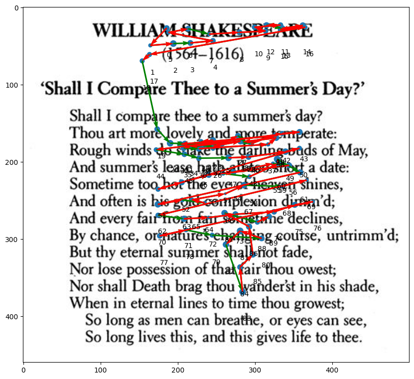

# EyeFeatures Overview
### Python package for exploring, visualizing, and analyzing eyetracking data

## 1. Preprocessing

#### EyeFeature provides methods to preprocess a raw gaze dataset into a sequence of fixations. For demonstration purposes we use IVT:


```python
from preprocessing.fixation_extraction import IVT

x = 'norm_pos_x'
y = 'norm_pos_y'
t = 'gaze_timestamp'

ivt = IVT(x=x, y=y, t=t, pk=['Participant', 'tekst'], threshold=0.10)
data_ivt = ivt.transform(df_gaze)
data_ivt
```


<table border="1" class="dataframe">
  <thead>
    <tr style="text-align: right;">
      <th></th>
      <th>Participant</th>
      <th>tekst</th>
      <th>norm_pos_x</th>
      <th>norm_pos_y</th>
      <th>start_time</th>
      <th>end_time</th>
      <th>distance_min</th>
      <th>distance_max</th>
      <th>duration</th>
    </tr>
  </thead>
  <tbody>
    <tr>
      <th>0</th>
      <td>1.0</td>
      <td>1.0</td>
      <td>0.242056</td>
      <td>0.510704</td>
      <td>317242.694809</td>
      <td>317242.715197</td>
      <td>0.000988</td>
      <td>0.012066</td>
      <td>0.020388</td>
    </tr>
    <tr>
      <th>1</th>
      <td>1.0</td>
      <td>1.0</td>
      <td>0.243933</td>
      <td>0.507985</td>
      <td>317242.728767</td>
      <td>317242.766803</td>
      <td>0.000971</td>
      <td>0.010593</td>
      <td>0.038036</td>
    </tr>
    <tr>
      <th>2</th>
      <td>1.0</td>
      <td>1.0</td>
      <td>0.244890</td>
      <td>0.507302</td>
      <td>317242.779258</td>
      <td>317242.779258</td>
      <td>0.002909</td>
      <td>0.002909</td>
      <td>0.000000</td>
    </tr>
    <tr>
      <th>3</th>
      <td>1.0</td>
      <td>1.0</td>
      <td>0.243674</td>
      <td>0.473291</td>
      <td>317242.805314</td>
      <td>317243.004508</td>
      <td>0.000679</td>
      <td>0.054160</td>
      <td>0.199194</td>
    </tr>
    <tr>
      <th>4</th>
      <td>1.0</td>
      <td>1.0</td>
      <td>0.246791</td>
      <td>0.435542</td>
      <td>317243.017989</td>
      <td>317243.024352</td>
      <td>0.000697</td>
      <td>0.001653</td>
      <td>0.006363</td>
    </tr>
    <tr>
      <th>...</th>
      <td>...</td>
      <td>...</td>
      <td>...</td>
      <td>...</td>
      <td>...</td>
      <td>...</td>
      <td>...</td>
      <td>...</td>
      <td>...</td>
    </tr>
    <tr>
      <th>193707</th>
      <td>10.0</td>
      <td>37.0</td>
      <td>0.407710</td>
      <td>0.521161</td>
      <td>289275.675247</td>
      <td>289275.675247</td>
      <td>0.003031</td>
      <td>0.003031</td>
      <td>0.000000</td>
    </tr>
    <tr>
      <th>193708</th>
      <td>10.0</td>
      <td>37.0</td>
      <td>0.409729</td>
      <td>0.518900</td>
      <td>289275.689806</td>
      <td>289275.689806</td>
      <td>0.001765</td>
      <td>0.001765</td>
      <td>0.000000</td>
    </tr>
    <tr>
      <th>193709</th>
      <td>10.0</td>
      <td>37.0</td>
      <td>0.408336</td>
      <td>0.519858</td>
      <td>289275.703919</td>
      <td>289275.703919</td>
      <td>0.003316</td>
      <td>0.003316</td>
      <td>0.000000</td>
    </tr>
    <tr>
      <th>193710</th>
      <td>10.0</td>
      <td>37.0</td>
      <td>0.410257</td>
      <td>0.516873</td>
      <td>289275.715644</td>
      <td>289275.715644</td>
      <td>0.001421</td>
      <td>0.001421</td>
      <td>0.000000</td>
    </tr>
    <tr>
      <th>193711</th>
      <td>10.0</td>
      <td>37.0</td>
      <td>0.447454</td>
      <td>0.495215</td>
      <td>289275.737404</td>
      <td>289275.759911</td>
      <td>0.012606</td>
      <td>0.049920</td>
      <td>0.022508</td>
    </tr>
  </tbody>
</table>
<p>193712 rows × 9 columns</p>
</div>


#### Visual Angle Dispersion (VAD) extraction is yet to be implemented. In further steps we use externally preprocessed dataset of fixations.

## 2. Visualization
#### The visualization module allows users to plot the graphic images of scanpaths over the original background.


```python
from visualization.static_visualization import scanpath_visualization
from PIL import Image

dur = 'duration'
dis = 'dispersion'
t = 'start_timestamp'

picture = "./background.jpg"
width, height = None, None
with Image.open(picture) as im:
    width, height = im.size


data = df_fix[(df_fix.Participant == 1) & (df_fix.tekst == 26)]
scanpath_visualization(
    data_=data, x=x, y=y, duration=dur, dispersion=dis, 
    time_stamps=t, img_path=picture, points_enumeration=True, 
    regression_color="red", micro_sac_color="yellow",  is_vectors=True
)
```


    

    


## 3. Feature Extraction
#### The features module has a variety of different features, ranging from simple aggregations to more complex scanpath algorithms.

#### User can either 
- test each feature independently by importing it from the relevant module.
- make use of Extractor class which is fully integrated into standard sklearn pipelines

### 3.1 Independent usage

#### Extracting scanpaths features using MultiMatch algorithm.


```python
from features.scanpath_dist import MultiMatchDist

dist = MultiMatchDist(x=x, y=y, duration=dur, path_pk=['tekst'], pk=['Participant', 'tekst'], return_df=True)
data = df_fix[df_fix.Participant < 6]
dist.fit_transform(data)
```


<table border="1" class="dataframe">
  <thead>
    <tr style="text-align: right;">
      <th></th>
      <th>mm_shape</th>
      <th>mm_angle</th>
      <th>mm_len</th>
      <th>mm_pos</th>
      <th>mm_duration</th>
    </tr>
  </thead>
  <tbody>
    <tr>
      <th>0</th>
      <td>0.984409</td>
      <td>0.798314</td>
      <td>0.979722</td>
      <td>0.829876</td>
      <td>0.696303</td>
    </tr>
    <tr>
      <th>1</th>
      <td>0.988953</td>
      <td>0.912963</td>
      <td>0.985781</td>
      <td>0.846121</td>
      <td>0.736894</td>
    </tr>
    <tr>
      <th>2</th>
      <td>0.988904</td>
      <td>0.729273</td>
      <td>0.985388</td>
      <td>0.762853</td>
      <td>0.511047</td>
    </tr>
    <tr>
      <th>3</th>
      <td>0.988411</td>
      <td>0.842714</td>
      <td>0.987568</td>
      <td>0.792416</td>
      <td>0.733453</td>
    </tr>
    <tr>
      <th>4</th>
      <td>0.995065</td>
      <td>0.975281</td>
      <td>0.996452</td>
      <td>0.808010</td>
      <td>0.938098</td>
    </tr>
    <tr>
      <th>...</th>
      <td>...</td>
      <td>...</td>
      <td>...</td>
      <td>...</td>
      <td>...</td>
    </tr>
    <tr>
      <th>172</th>
      <td>1.000000</td>
      <td>1.000000</td>
      <td>1.000000</td>
      <td>1.000000</td>
      <td>0.977153</td>
    </tr>
    <tr>
      <th>173</th>
      <td>0.990601</td>
      <td>0.856112</td>
      <td>0.989796</td>
      <td>0.950561</td>
      <td>0.648517</td>
    </tr>
    <tr>
      <th>174</th>
      <td>0.987199</td>
      <td>0.842388</td>
      <td>0.986055</td>
      <td>0.904987</td>
      <td>0.626429</td>
    </tr>
    <tr>
      <th>175</th>
      <td>0.995229</td>
      <td>0.933000</td>
      <td>0.997590</td>
      <td>0.976402</td>
      <td>0.734341</td>
    </tr>
    <tr>
      <th>176</th>
      <td>0.991163</td>
      <td>0.833923</td>
      <td>0.990731</td>
      <td>0.912807</td>
      <td>0.629052</td>
    </tr>
  </tbody>
</table>
<p>177 rows × 5 columns</p>
</div>


#### Feature classes support <i>shift features</i> calculated using provided list of stats on fit which are used on transform.


```python
from features.stats import SaccadeLength

transf = SaccadeLength(stats=['min', 'kurtosis', 'max'], x=x, y=y, t=t, duration=dur, pk=['tekst', 'Participant'])
transf.fit_transform(df_fix)
```


<table border="1" class="dataframe">
  <thead>
    <tr style="text-align: right;">
      <th></th>
      <th>sac_len_min</th>
      <th>sac_len_kurtosis</th>
      <th>sac_len_max</th>
    </tr>
  </thead>
  <tbody>
    <tr>
      <th>0</th>
      <td>0.002657</td>
      <td>3.460042</td>
      <td>0.433486</td>
    </tr>
    <tr>
      <th>1</th>
      <td>0.003757</td>
      <td>2.434788</td>
      <td>0.321837</td>
    </tr>
    <tr>
      <th>2</th>
      <td>0.003663</td>
      <td>4.659126</td>
      <td>0.365776</td>
    </tr>
    <tr>
      <th>3</th>
      <td>0.000212</td>
      <td>5.574937</td>
      <td>0.342315</td>
    </tr>
    <tr>
      <th>4</th>
      <td>0.002705</td>
      <td>7.137036</td>
      <td>0.375434</td>
    </tr>
    <tr>
      <th>...</th>
      <td>...</td>
      <td>...</td>
      <td>...</td>
    </tr>
    <tr>
      <th>343</th>
      <td>0.002947</td>
      <td>4.965125</td>
      <td>0.294657</td>
    </tr>
    <tr>
      <th>344</th>
      <td>0.002400</td>
      <td>3.489713</td>
      <td>0.285337</td>
    </tr>
    <tr>
      <th>345</th>
      <td>0.001577</td>
      <td>3.860485</td>
      <td>0.302061</td>
    </tr>
    <tr>
      <th>346</th>
      <td>0.005622</td>
      <td>3.400580</td>
      <td>0.264520</td>
    </tr>
    <tr>
      <th>347</th>
      <td>0.003055</td>
      <td>3.638501</td>
      <td>0.271675</td>
    </tr>
  </tbody>
</table>
<p>348 rows × 3 columns</p>
</div>


```python
transf = SaccadeLength(stats=['min', 'kurtosis', 'max'], x=x, y=y, t=t, duration=dur, 
                       pk=['tekst', 'Participant'], shift_pk=['tekst'], shift_features=True)
transf.fit_transform(df_fix)
```


<table border="1" class="dataframe">
  <thead>
    <tr style="text-align: right;">
      <th></th>
      <th>sac_len_min</th>
      <th>sac_len_kurtosis</th>
      <th>sac_len_max</th>
      <th>sac_len_min_shift</th>
      <th>sac_len_kurtosis_shift</th>
      <th>sac_len_max_shift</th>
    </tr>
  </thead>
  <tbody>
    <tr>
      <th>0</th>
      <td>0.002657</td>
      <td>3.460042</td>
      <td>0.433486</td>
      <td>-2.463992</td>
      <td>0.993393</td>
      <td>-2.033163</td>
    </tr>
    <tr>
      <th>1</th>
      <td>0.003757</td>
      <td>2.434788</td>
      <td>0.321837</td>
      <td>-1.205358</td>
      <td>1.225673</td>
      <td>-0.887279</td>
    </tr>
    <tr>
      <th>2</th>
      <td>0.003663</td>
      <td>4.659126</td>
      <td>0.365776</td>
      <td>-8.031410</td>
      <td>-3.375947</td>
      <td>-7.669297</td>
    </tr>
    <tr>
      <th>3</th>
      <td>0.000212</td>
      <td>5.574937</td>
      <td>0.342315</td>
      <td>-4.004793</td>
      <td>1.569932</td>
      <td>-3.662690</td>
    </tr>
    <tr>
      <th>4</th>
      <td>0.002705</td>
      <td>7.137036</td>
      <td>0.375434</td>
      <td>-5.951135</td>
      <td>1.183196</td>
      <td>-5.578406</td>
    </tr>
    <tr>
      <th>...</th>
      <td>...</td>
      <td>...</td>
      <td>...</td>
      <td>...</td>
      <td>...</td>
      <td>...</td>
    </tr>
    <tr>
      <th>343</th>
      <td>0.002947</td>
      <td>4.965125</td>
      <td>0.294657</td>
      <td>-1.867989</td>
      <td>3.094189</td>
      <td>-1.576280</td>
    </tr>
    <tr>
      <th>344</th>
      <td>0.002400</td>
      <td>3.489713</td>
      <td>0.285337</td>
      <td>-1.685052</td>
      <td>1.802262</td>
      <td>-1.402115</td>
    </tr>
    <tr>
      <th>345</th>
      <td>0.001577</td>
      <td>3.860485</td>
      <td>0.302061</td>
      <td>-1.704004</td>
      <td>2.154904</td>
      <td>-1.403521</td>
    </tr>
    <tr>
      <th>346</th>
      <td>0.005622</td>
      <td>3.400580</td>
      <td>0.264520</td>
      <td>-5.504738</td>
      <td>-2.109780</td>
      <td>-5.245840</td>
    </tr>
    <tr>
      <th>347</th>
      <td>0.003055</td>
      <td>3.638501</td>
      <td>0.271675</td>
      <td>-2.478121</td>
      <td>1.157324</td>
      <td>-2.209502</td>
    </tr>
  </tbody>
</table>
<p>348 rows × 6 columns</p>
</div>


```python
print(transf.shift_mem)
```

    tekst ['min', 'kurtosis', 'max']
    1.0 [2.4666487854748462, 2.4666487854748462, 2.4666487854748462]
    94.0 [1.2091154206764536, 1.2091154206764536, 1.2091154206764536]
    57.0 [8.035072768690364, 8.035072768690364, 8.035072768690364]
    17.0 [4.0050054062399925, 4.0050054062399925, 4.0050054062399925]
    66.0 [5.953840518950972, 5.953840518950972, 5.953840518950972]
    21.0 [1.7917335944607586, 1.7917335944607586, 1.7917335944607586]
    14.0 [2.2983542969384283, 2.2983542969384283, 2.2983542969384283]
    60.0 [2.5619581935203017, 2.5619581935203017, 2.5619581935203017]
    5.0 [1.7516830672813763, 1.7516830672813763, 1.7516830672813763]
    76.0 [1.885048066033195, 1.885048066033195, 1.885048066033195]
    ................................................................


### 3.2 Extractor usage


```python
from features.stats import FixationDuration, FixationVAD
from features.stats import SaccadeLength, SaccadeAcceleration, SaccadeVelocity
from features.stats import RegressionCount, RegressionAcceleration, RegressionVelocity, RegressionLength
from features.stats import MicroSaccadeLength, MicroSaccadeVelocity, MicroSaccadeAcceleration
from features.measures import HurstExponent
from features.extractor import Extractor

from features.scanpath_dist import ScanMatchDist, EyeAnalysisDist
from features.scanpath_dist import EucDist, HauDist, DTWDist, MannanDist, DFDist, TDEDist

msv = 4.7  # MS_VELOCITY_THRESHOLD
msa = 1.2  # MS_AMPLITUDE_THRESHOLD

features = [
    RegressionCount(),
    RegressionLength(stats=['kurtosis', 'skew']),
    RegressionVelocity(stats=['kurtosis', 'skew']),
    RegressionAcceleration(stats=['kurtosis', 'skew']),
    FixationDuration(stats=['median', 'skew', 'var']),
    FixationVAD(stats=['mean', 'median']),
    SaccadeLength(stats=['var', 'std']),
    SaccadeAcceleration(stats=['var', 'mean']),
    SaccadeVelocity(stats=['min', 'kurtosis', 'max']),
    MicroSaccadeVelocity(stats=['min'], min_dispersion=msa, max_velocity=msv),
    MicroSaccadeAcceleration(stats=['var'], min_dispersion=msa, max_velocity=msv),
    MicroSaccadeLength(stats=['max'], min_dispersion=msa, max_velocity=msv),
    HurstExponent(var='duration', n_iters=10, fill_strategy='last'),
    ScanMatchDist(sub_mat=np.random.randint(0, 11, size=(20, 20)))
]

extractor = Extractor(features=features, x=x, y=y, t=t, duration=dur, 
                      dispersion=dis, pk=['tekst', 'Participant'], 
                      path_pk=['tekst'], return_df=True)

extractor.fit_transform(df_fix)
```


<table border="1" class="dataframe">
  <thead>
    <tr style="text-align: right;">
      <th></th>
      <th>reg_count</th>
      <th>reg_len_kurtosis</th>
      <th>reg_len_skew</th>
      <th>reg_vel_kurtosis</th>
      <th>reg_vel_skew</th>
      <th>reg_acc_kurtosis</th>
      <th>reg_acc_skew</th>
      <th>fix_dur_median</th>
      <th>fix_dur_skew</th>
      <th>fix_dur_var</th>
      <th>...</th>
      <th>sac_acc_var</th>
      <th>sac_acc_mean</th>
      <th>sac_vel_min</th>
      <th>sac_vel_kurtosis</th>
      <th>sac_vel_max</th>
      <th>microsac_vel_min</th>
      <th>microsac_acc_var</th>
      <th>microsac_len_max</th>
      <th>he_duration</th>
      <th>scan_match_dist</th>
    </tr>
  </thead>
  <tbody>
    <tr>
      <th>0</th>
      <td>124</td>
      <td>1.700848</td>
      <td>1.586755</td>
      <td>3.901072</td>
      <td>1.805168</td>
      <td>5.061057</td>
      <td>1.905850</td>
      <td>165.7635</td>
      <td>0.603230</td>
      <td>4009.509338</td>
      <td>...</td>
      <td>7995.840679</td>
      <td>100.298862</td>
      <td>0.093334</td>
      <td>5.209393</td>
      <td>13.717103</td>
      <td>0.121675</td>
      <td>7083.618247</td>
      <td>0.280782</td>
      <td>0.012489</td>
      <td>144.0</td>
    </tr>
    <tr>
      <th>1</th>
      <td>87</td>
      <td>0.272334</td>
      <td>1.272205</td>
      <td>-0.121873</td>
      <td>0.747655</td>
      <td>4.609038</td>
      <td>2.000626</td>
      <td>170.1305</td>
      <td>1.279994</td>
      <td>7365.894447</td>
      <td>...</td>
      <td>7762.127058</td>
      <td>82.763301</td>
      <td>0.023706</td>
      <td>1.062297</td>
      <td>8.626671</td>
      <td>0.023706</td>
      <td>4777.387755</td>
      <td>0.264537</td>
      <td>0.012318</td>
      <td>89.0</td>
    </tr>
    <tr>
      <th>2</th>
      <td>79</td>
      <td>1.859301</td>
      <td>1.684907</td>
      <td>2.001064</td>
      <td>1.373967</td>
      <td>1.652747</td>
      <td>1.481707</td>
      <td>179.7400</td>
      <td>2.038973</td>
      <td>14658.009058</td>
      <td>...</td>
      <td>5207.052868</td>
      <td>86.198453</td>
      <td>0.070638</td>
      <td>3.861622</td>
      <td>10.717298</td>
      <td>0.102426</td>
      <td>5092.358819</td>
      <td>0.130794</td>
      <td>0.017036</td>
      <td>76.0</td>
    </tr>
    <tr>
      <th>3</th>
      <td>74</td>
      <td>4.173494</td>
      <td>2.137320</td>
      <td>0.655806</td>
      <td>0.504103</td>
      <td>0.322024</td>
      <td>1.097767</td>
      <td>180.8325</td>
      <td>0.846694</td>
      <td>6486.861172</td>
      <td>...</td>
      <td>7674.049803</td>
      <td>96.470877</td>
      <td>0.003426</td>
      <td>0.792346</td>
      <td>7.038810</td>
      <td>0.140142</td>
      <td>9785.286986</td>
      <td>0.272092</td>
      <td>0.019069</td>
      <td>93.0</td>
    </tr>
    <tr>
      <th>4</th>
      <td>102</td>
      <td>4.395098</td>
      <td>2.214670</td>
      <td>2.363687</td>
      <td>1.314530</td>
      <td>15.968599</td>
      <td>3.302037</td>
      <td>183.4635</td>
      <td>2.503064</td>
      <td>13125.694763</td>
      <td>...</td>
      <td>7890.583376</td>
      <td>83.211408</td>
      <td>0.018103</td>
      <td>2.786342</td>
      <td>8.924919</td>
      <td>0.018103</td>
      <td>5353.574600</td>
      <td>0.256157</td>
      <td>0.010373</td>
      <td>64.0</td>
    </tr>
    <tr>
      <th>...</th>
      <td>...</td>
      <td>...</td>
      <td>...</td>
      <td>...</td>
      <td>...</td>
      <td>...</td>
      <td>...</td>
      <td>...</td>
      <td>...</td>
      <td>...</td>
      <td>...</td>
      <td>...</td>
      <td>...</td>
      <td>...</td>
      <td>...</td>
      <td>...</td>
      <td>...</td>
      <td>...</td>
      <td>...</td>
      <td>...</td>
      <td>...</td>
    </tr>
    <tr>
      <th>343</th>
      <td>63</td>
      <td>4.000265</td>
      <td>2.160049</td>
      <td>1.000036</td>
      <td>0.728059</td>
      <td>4.628856</td>
      <td>1.986858</td>
      <td>190.5965</td>
      <td>4.037164</td>
      <td>30004.303327</td>
      <td>...</td>
      <td>4824.296129</td>
      <td>87.232770</td>
      <td>0.114508</td>
      <td>1.235245</td>
      <td>6.348794</td>
      <td>0.114508</td>
      <td>3481.419925</td>
      <td>0.187302</td>
      <td>0.025275</td>
      <td>30.0</td>
    </tr>
    <tr>
      <th>344</th>
      <td>47</td>
      <td>1.890739</td>
      <td>1.579243</td>
      <td>-0.354225</td>
      <td>0.763913</td>
      <td>7.966387</td>
      <td>2.816351</td>
      <td>168.3390</td>
      <td>6.505634</td>
      <td>24052.831747</td>
      <td>...</td>
      <td>14317.002190</td>
      <td>102.355705</td>
      <td>0.285069</td>
      <td>0.077578</td>
      <td>6.413577</td>
      <td>0.285069</td>
      <td>2838.026468</td>
      <td>0.157819</td>
      <td>0.028088</td>
      <td>100.0</td>
    </tr>
    <tr>
      <th>345</th>
      <td>47</td>
      <td>2.475845</td>
      <td>1.872959</td>
      <td>0.316662</td>
      <td>0.774567</td>
      <td>4.903744</td>
      <td>2.188557</td>
      <td>192.8350</td>
      <td>3.377704</td>
      <td>22395.407932</td>
      <td>...</td>
      <td>13725.723304</td>
      <td>114.838759</td>
      <td>0.146598</td>
      <td>0.410978</td>
      <td>6.594502</td>
      <td>0.146598</td>
      <td>5437.648702</td>
      <td>0.140706</td>
      <td>0.029379</td>
      <td>57.0</td>
    </tr>
    <tr>
      <th>346</th>
      <td>30</td>
      <td>1.104913</td>
      <td>1.338630</td>
      <td>-0.519621</td>
      <td>0.632269</td>
      <td>6.927029</td>
      <td>2.705323</td>
      <td>192.6005</td>
      <td>2.101122</td>
      <td>7848.454812</td>
      <td>...</td>
      <td>7723.681592</td>
      <td>88.639889</td>
      <td>0.381639</td>
      <td>0.652740</td>
      <td>6.086932</td>
      <td>0.381639</td>
      <td>4246.297739</td>
      <td>0.126212</td>
      <td>0.050134</td>
      <td>54.0</td>
    </tr>
    <tr>
      <th>347</th>
      <td>27</td>
      <td>0.406466</td>
      <td>1.403387</td>
      <td>0.092395</td>
      <td>0.893799</td>
      <td>10.060059</td>
      <td>2.784046</td>
      <td>186.0990</td>
      <td>1.389099</td>
      <td>7694.254556</td>
      <td>...</td>
      <td>4547.052072</td>
      <td>89.285024</td>
      <td>0.201375</td>
      <td>1.452558</td>
      <td>6.743899</td>
      <td>0.201375</td>
      <td>3580.897585</td>
      <td>0.147031</td>
      <td>0.049745</td>
      <td>32.0</td>
    </tr>
  </tbody>
</table>
<p>348 rows × 26 columns</p>
</div>

### 3.3 Extracting features for each area of interest

```python
reg_vel = RegressionVelocity(stats=['kurtosis', 'skew'], x=x, y=y, t=t, duration=dur, 
                      dispersion=dis, aoi=aoi, pk=['tekst', 'Participant'], return_df=True)
res = reg_vel.transform(df_fix)
res.fillna(0, inplace=True)
res
```


<div>
<style scoped>
    .dataframe tbody tr th:only-of-type {
        vertical-align: middle;
    }

    .dataframe tbody tr th {
        vertical-align: top;
    }

    .dataframe thead th {
        text-align: right;
    }
</style>
<table border="1" class="dataframe">
  <thead>
    <tr style="text-align: right;">
      <th></th>
      <th>reg_vel_C_kurtosis</th>
      <th>reg_vel_C_skew</th>
      <th>reg_vel_N_kurtosis</th>
      <th>reg_vel_N_skew</th>
      <th>reg_vel_D_kurtosis</th>
      <th>reg_vel_D_skew</th>
      <th>reg_vel_notext_kurtosis</th>
      <th>reg_vel_notext_skew</th>
      <th>reg_vel_nan_kurtosis</th>
      <th>reg_vel_nan_skew</th>
    </tr>
  </thead>
  <tbody>
    <tr>
      <th>0</th>
      <td>6.772461</td>
      <td>2.313625</td>
      <td>1.295909</td>
      <td>0.987085</td>
      <td>0.820745</td>
      <td>0.950178</td>
      <td>0.0</td>
      <td>0.0</td>
      <td>0</td>
      <td>0</td>
    </tr>
    <tr>
      <th>1</th>
      <td>0.000000</td>
      <td>0.000000</td>
      <td>0.013302</td>
      <td>0.763258</td>
      <td>-0.718680</td>
      <td>-0.206030</td>
      <td>0.0</td>
      <td>0.0</td>
      <td>0</td>
      <td>0</td>
    </tr>
    <tr>
      <th>2</th>
      <td>-1.272015</td>
      <td>0.208680</td>
      <td>-0.020635</td>
      <td>0.893706</td>
      <td>2.013581</td>
      <td>-1.522644</td>
      <td>0.0</td>
      <td>0.0</td>
      <td>0</td>
      <td>0</td>
    </tr>
    <tr>
      <th>3</th>
      <td>0.807392</td>
      <td>0.167292</td>
      <td>0.614425</td>
      <td>0.448141</td>
      <td>-1.872466</td>
      <td>0.432761</td>
      <td>0.0</td>
      <td>0.0</td>
      <td>0</td>
      <td>0</td>
    </tr>
    <tr>
      <th>4</th>
      <td>4.087055</td>
      <td>1.621437</td>
      <td>1.526085</td>
      <td>1.099990</td>
      <td>-0.978084</td>
      <td>-0.285111</td>
      <td>0.0</td>
      <td>0.0</td>
      <td>0</td>
      <td>0</td>
    </tr>
    <tr>
      <th>...</th>
      <td>...</td>
      <td>...</td>
      <td>...</td>
      <td>...</td>
      <td>...</td>
      <td>...</td>
      <td>...</td>
      <td>...</td>
      <td>...</td>
      <td>...</td>
    </tr>
    <tr>
      <th>269</th>
      <td>0.000000</td>
      <td>0.000000</td>
      <td>0.000000</td>
      <td>0.000000</td>
      <td>0.000000</td>
      <td>0.000000</td>
      <td>0.0</td>
      <td>0.0</td>
      <td>0</td>
      <td>0</td>
    </tr>
    <tr>
      <th>270</th>
      <td>0.000000</td>
      <td>0.000000</td>
      <td>0.000000</td>
      <td>0.000000</td>
      <td>0.000000</td>
      <td>0.000000</td>
      <td>0.0</td>
      <td>0.0</td>
      <td>0</td>
      <td>0</td>
    </tr>
    <tr>
      <th>271</th>
      <td>0.000000</td>
      <td>0.000000</td>
      <td>0.000000</td>
      <td>0.000000</td>
      <td>0.000000</td>
      <td>0.000000</td>
      <td>0.0</td>
      <td>0.0</td>
      <td>0</td>
      <td>0</td>
    </tr>
    <tr>
      <th>272</th>
      <td>0.000000</td>
      <td>0.000000</td>
      <td>0.000000</td>
      <td>0.000000</td>
      <td>0.000000</td>
      <td>0.000000</td>
      <td>0.0</td>
      <td>0.0</td>
      <td>0</td>
      <td>0</td>
    </tr>
    <tr>
      <th>273</th>
      <td>0.000000</td>
      <td>0.000000</td>
      <td>0.000000</td>
      <td>0.000000</td>
      <td>0.000000</td>
      <td>0.000000</td>
      <td>0.0</td>
      <td>0.0</td>
      <td>0</td>
      <td>0</td>
    </tr>
  </tbody>
</table>
<p>274 rows × 10 columns</p>
</div>

### 3.4 Integrating into `sklearn` pipeline


```python
from sklearn.pipeline import Pipeline
from sklearn.preprocessing import StandardScaler
from sklearn.linear_model import LogisticRegression

pipe = Pipeline([('extractor', extractor), ('scaler', StandardScaler()), ('lr', LogisticRegression())])
```


```python
X_train = df_fix[df_fix.Participant < 9].drop(columns="ACC")
X_test = df_fix[df_fix.Participant >= 9].drop(columns="ACC")

y_train = df_target[df_target.Participant < 9].ACC # binary class
y_test = df_target[df_target.Participant >= 9].ACC

pipe.fit(X_train, y_train).score(X_test, y_test)
```


    Accuracy on test: 0.8351351351351351

### 3.5 Heatmaps

Example usage of similarity matrix.

```python
from seaborn import heatmap
from features.scanpath_dist import hau_dist
from features.scanpath_complex import get_sim_matrix

def similarity_metric(path1, path2, c=5):
    return 1 / (1 + c * hau_dist(path1, path2))

x = 'norm_pos_x'
y = 'norm_pos_y'
t = 'start_timestamp'

scanpaths = []
texts = data.tekst.unique()
for t in texts:
    df_p = data[data.tekst == t]
    x_path, y_path = df_p[x], df_p[y]
    scanpaths.append(np.vstack([x_path, y_path]))

sim_matrix = get_sim_matrix(scanpaths, similarity_metric)
heatmap(sim_matrix);
```


