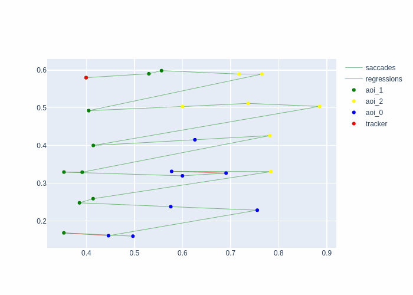

tracker_animation
==================

.. currentmodule:: eyefeatures.visualization.dynamic_visualization

.. autofunction:: tracker_animation

.. _dynamic_vis_2_example:

Usage Example
*************

.. literalinclude:: ../src/examples/dynamic_vis_2.py
   :language: python

