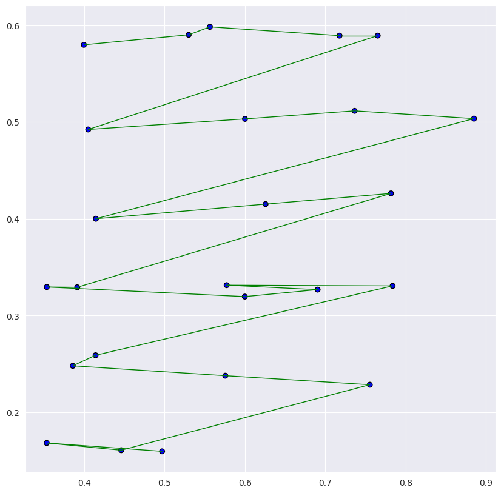

scanpath_visualization
======================

.. currentmodule:: eyefeatures.visualization.static_visualization

.. autofunction:: scanpath_visualization

.. _static_vis_example:

Usage Example
*************

.. literalinclude:: ../src/examples/static_vis.py
   :language: python

