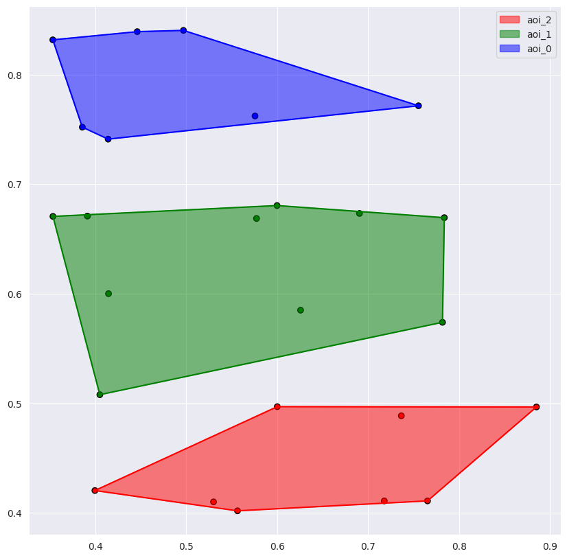
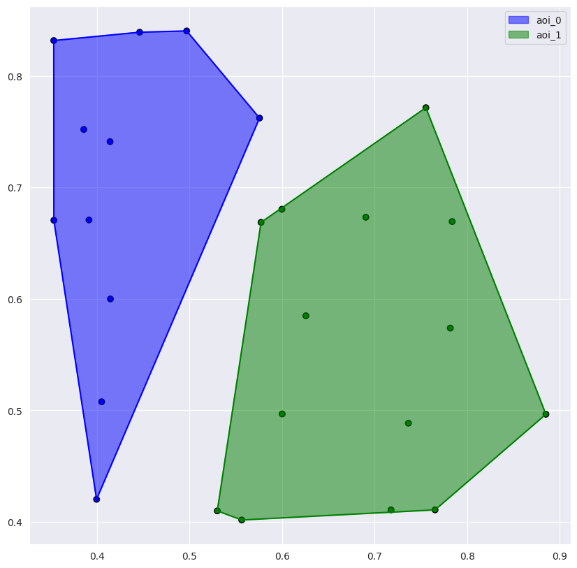
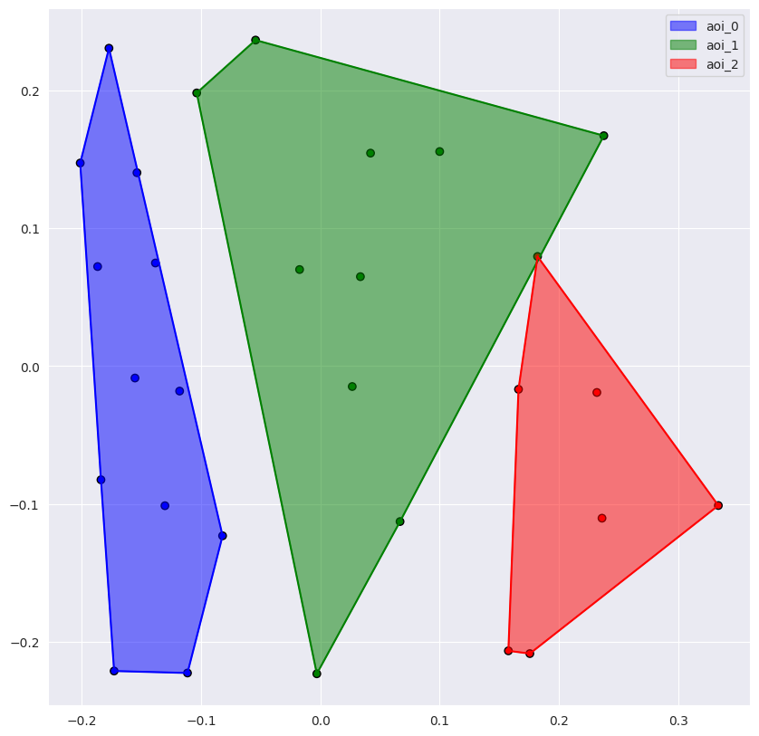
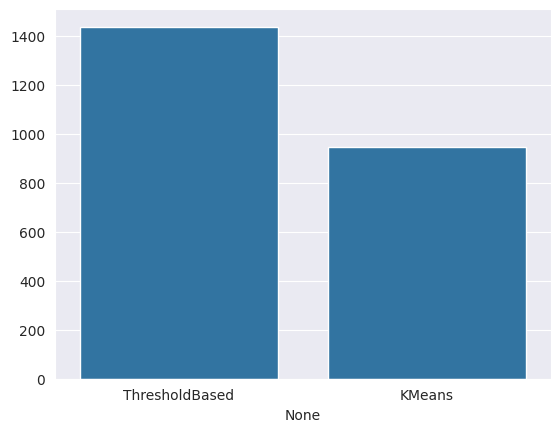
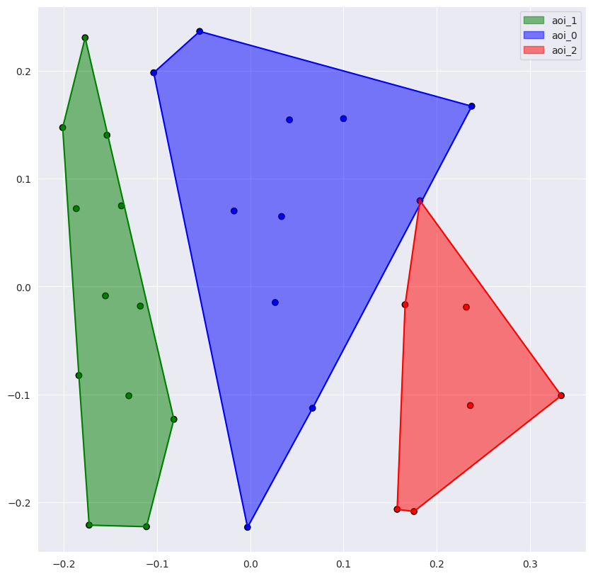

# AOI definition tutorial
This tutorial describes methods and utilities for AOI definition. Firstly, we will import all AOI methods and load the dataset.\
> Tip: The dataset should include preprocessed data with fixations. If the data isn't preprocessed, and you want to learn how to do this, then explore the preprocessing tutorial.


```python
from eyetracking.preprocessing.aoi_extraction import ThresholdBased, ShapeBased
from eyetracking.visualization.static_visualization import scanpath_visualization
import os, requests
import pandas as pd

def load_data():
    '''
    Download and load the Paris experiment dataset from Zenodo.
    The dataset contains scanpaths data from 15 participants reading approximately 180 texts.
    The dataset is normalized and split into X (fixations data), Y (target), and other features.
    Deatiled description of variables and task can be found at: https://zenodo.org/records/4655840
    '''
    if not os.path.exists("data/em-y35-fasttext.csv"):
        url = "https://zenodo.org/records/4655840/files/em-y35-fasttext.csv?download=1"
        response = requests.get(url, stream=True)
    
        os.makedirs("data", exist_ok=True)
        with open("data/em-y35-fasttext.csv", "wb") as handle:
            for data in response.iter_content(chunk_size=1024):
                handle.write(data)
    
    df = pd.read_csv("data/em-y35-fasttext.csv")
    df.X = df.X/df.X.max()
    df.Y = df.Y/df.Y.max()
    df = df.rename(columns={'FDUR': 'duration', 'X': 'norm_pos_x', 'Y': 'norm_pos_y'})
    X = df[['SUBJ_NAME', 'TEXT', 'norm_pos_x', 'norm_pos_y', 'duration']]
    Y = df[['SUBJ_NAME', 'TEXT', 'TEXT_TYPE', 'TEXT_TYPE_2']].drop_duplicates()
    other_features = df.drop(columns = ['SUBJ_NAME', 'TEXT', 'norm_pos_x', 'norm_pos_y', 'duration'])
    
    return X, Y, other_features
```


```python
x = "norm_pos_x"
y = "norm_pos_y"
pk = ["SUBJ_NAME", "TEXT"]
aoi = "AOI"
data, target, other = load_data()
data.head()
```


<div>
<style scoped>
    .dataframe tbody tr th:only-of-type {
        vertical-align: middle;
    }

    .dataframe tbody tr th {
        vertical-align: top;
    }

    .dataframe thead th {
        text-align: right;
    }
</style>
<table border="1" class="dataframe">
  <thead>
    <tr style="text-align: right;">
      <th></th>
      <th>SUBJ_NAME</th>
      <th>TEXT</th>
      <th>norm_pos_x</th>
      <th>norm_pos_y</th>
      <th>duration</th>
    </tr>
  </thead>
  <tbody>
    <tr>
      <th>0</th>
      <td>s01</td>
      <td>chasse_oiseaux-a1</td>
      <td>0.376268</td>
      <td>0.384969</td>
      <td>96</td>
    </tr>
    <tr>
      <th>1</th>
      <td>s01</td>
      <td>chasse_oiseaux-a1</td>
      <td>0.437754</td>
      <td>0.383532</td>
      <td>129</td>
    </tr>
    <tr>
      <th>2</th>
      <td>s01</td>
      <td>chasse_oiseaux-a1</td>
      <td>0.546146</td>
      <td>0.382957</td>
      <td>280</td>
    </tr>
    <tr>
      <th>3</th>
      <td>s01</td>
      <td>chasse_oiseaux-a1</td>
      <td>0.706643</td>
      <td>0.399626</td>
      <td>278</td>
    </tr>
    <tr>
      <th>4</th>
      <td>s01</td>
      <td>chasse_oiseaux-a1</td>
      <td>0.724645</td>
      <td>0.397615</td>
      <td>266</td>
    </tr>
  </tbody>
</table>
</div>


Delete the records that contain less than 2 fixation.


```python
data["to_filter"] = data.apply(lambda row: '_'.join([str(row[column]) for column in pk]), axis=1)
data.head()
```


<div>
<style scoped>
    .dataframe tbody tr th:only-of-type {
        vertical-align: middle;
    }

    .dataframe tbody tr th {
        vertical-align: top;
    }

    .dataframe thead th {
        text-align: right;
    }
</style>
<table border="1" class="dataframe">
  <thead>
    <tr style="text-align: right;">
      <th></th>
      <th>SUBJ_NAME</th>
      <th>TEXT</th>
      <th>norm_pos_x</th>
      <th>norm_pos_y</th>
      <th>duration</th>
      <th>to_filter</th>
    </tr>
  </thead>
  <tbody>
    <tr>
      <th>0</th>
      <td>s01</td>
      <td>chasse_oiseaux-a1</td>
      <td>0.376268</td>
      <td>0.384969</td>
      <td>96</td>
      <td>s01_chasse_oiseaux-a1</td>
    </tr>
    <tr>
      <th>1</th>
      <td>s01</td>
      <td>chasse_oiseaux-a1</td>
      <td>0.437754</td>
      <td>0.383532</td>
      <td>129</td>
      <td>s01_chasse_oiseaux-a1</td>
    </tr>
    <tr>
      <th>2</th>
      <td>s01</td>
      <td>chasse_oiseaux-a1</td>
      <td>0.546146</td>
      <td>0.382957</td>
      <td>280</td>
      <td>s01_chasse_oiseaux-a1</td>
    </tr>
    <tr>
      <th>3</th>
      <td>s01</td>
      <td>chasse_oiseaux-a1</td>
      <td>0.706643</td>
      <td>0.399626</td>
      <td>278</td>
      <td>s01_chasse_oiseaux-a1</td>
    </tr>
    <tr>
      <th>4</th>
      <td>s01</td>
      <td>chasse_oiseaux-a1</td>
      <td>0.724645</td>
      <td>0.397615</td>
      <td>266</td>
      <td>s01_chasse_oiseaux-a1</td>
    </tr>
  </tbody>
</table>
</div>


```python
groups_count = data.groupby("to_filter").size()
mask = groups_count.loc[groups_count > 2].index
data = data.loc[data["to_filter"].isin(mask)]
```

Columns of data:
* ```SUBJ_NAME``` — id of the participant
* ```TEXT``` — label of the text
* ```norm_pos_x``` — normalized x-axis coordinate of the fixation [0, 1]
* ```norm_pos_y``` — normalized y-axis coordinate of the fixation [0, 1]
* ```duration``` — duration of the fixation in ms

## Shape-based method
It is a very simple method. It gets data with fixations, a list of tuples with shapes (rectangle, circle, ellipse), where each shape is a particular AOI, and a primary key. The last one is distinctive for each record. This method just checks if each fixation is in shape.


```python
shapes = [['r', (0., 0.7), (1., 1.)], ('r', (0., 0.5), (1., 0.7)), ('r', (0., 0.), (1., 0.5)),]
shape_based = ShapeBased(x, y, shapes=[shapes,], pk=pk, aoi_name=aoi) 
result_sb = shape_based.transform(data)
```


```python
record = result_sb[(result_sb['SUBJ_NAME'] == "s04") & (result_sb['TEXT'] == "chasse_oiseaux-a1")]
aoi_color = {"aoi_0" : "blue", "aoi_1" : "green", "aoi_2" : "red"}
scanpath_visualization(record, x=x, y=y, aoi="AOI", show_hull=True, with_axes=True, only_points=True, show_legend=True, aoi_c=aoi_color)
```


    


## Threshold-based
This method defines AOI by using kernel density estimation and pre-thresholding it. Each maximum in the windows is the center of the AOI. This method also needs the parameter ```window_size``` (the parameter of the sliding window where the method finds the density maximum).


```python
threshold_based = ThresholdBased(x=x, y=y, threshold=0.5, pk=pk, window_size=10, aoi_name=aoi)
result_tb = threshold_based.transform(data)
```


```python
record = result_tb[(result_tb['SUBJ_NAME'] == "s04") & (result_tb['TEXT'] == "chasse_oiseaux-a1")]
scanpath_visualization(record, x=x, y=y, aoi=aoi, show_hull=True, with_axes=True, only_points=True, show_legend=True, aoi_c=aoi_color)
```


    


You can also try other AOI definition methods.

## AOI extractor
The AOI extractor gets a list of the AOI methods and selects for AOI splitting with minimal entropy. It also supports Sklearn clustering methods. The extractor has an ```instance_column``` parameter. This is to separate particular instances, not records.


```python
from sklearn.cluster import KMeans
from eyetracking.preprocessing.aoi_extraction import AOIExtractor

methods = [ThresholdBased(threshold=0.0, window_size=6), KMeans(n_clusters=3)]
extractor = AOIExtractor(methods=methods, x=x, y=y, pk=pk, instance_columns=['TEXT'], aoi_name='AOI', show_best=True)
extractor.fit(data)
result_extr = extractor.transform(data)
```


```python
record = result_extr[(result_extr['SUBJ_NAME'] == "s01") & (result_extr['TEXT'] == "chasse_oiseaux-a1")]
scanpath_visualization(record, x=x, y=y, aoi=aoi, show_hull=True, with_axes=True, only_points=True, show_legend=True, aoi_c=aoi_color)
```


    


We want to know which method was chosen more often. Let's check it.


```python
df = pd.concat([result_extr.loc[result_extr['best_method'] == m.__class__.__name__].groupby("to_filter").size() for m in methods], axis=1)
df.rename(columns=dict(zip(df.columns, [el.__class__.__name__ for el in methods])), inplace=True)
check_count = df.count()
check_count
```


    ThresholdBased    1438
    KMeans             945
    dtype: int64


```python
import seaborn as sns
sns.barplot(x=check_count.index, y=check_count.values)
```


    <Axes: xlabel='None'>


    


## AOI Matcher 
Sometimes AOI methods shuffle AOI labels. The correct order of the AOI names and features is necessary for ML/DL. That is why the AOI matcher exists. Let's match the AOI.


```python
from eyetracking.preprocessing.aoi_extraction import AOIMatcher
matcher = AOIMatcher(x=x, y=y, pk=pk, instance_columns=["TEXT"], aoi=aoi, n_aoi=3)
result_match = matcher.transform(result_extr)
result_match.head()
```


<div>
<style scoped>
    .dataframe tbody tr th:only-of-type {
        vertical-align: middle;
    }

    .dataframe tbody tr th {
        vertical-align: top;
    }

    .dataframe thead th {
        text-align: right;
    }
</style>
<table border="1" class="dataframe">
  <thead>
    <tr style="text-align: right;">
      <th></th>
      <th>SUBJ_NAME</th>
      <th>TEXT</th>
      <th>norm_pos_x</th>
      <th>norm_pos_y</th>
      <th>duration</th>
      <th>to_filter</th>
      <th>AOI</th>
      <th>best_method</th>
    </tr>
  </thead>
  <tbody>
    <tr>
      <th>0</th>
      <td>s01</td>
      <td>aide_refugies-a1</td>
      <td>-0.259043</td>
      <td>-0.050774</td>
      <td>119</td>
      <td>s01_aide_refugies-a1</td>
      <td>aoi_1</td>
      <td>KMeans</td>
    </tr>
    <tr>
      <th>1</th>
      <td>s01</td>
      <td>aide_refugies-a1</td>
      <td>-0.172329</td>
      <td>-0.043732</td>
      <td>172</td>
      <td>s01_aide_refugies-a1</td>
      <td>aoi_1</td>
      <td>KMeans</td>
    </tr>
    <tr>
      <th>2</th>
      <td>s01</td>
      <td>aide_refugies-a1</td>
      <td>-0.033891</td>
      <td>-0.041002</td>
      <td>103</td>
      <td>s01_aide_refugies-a1</td>
      <td>aoi_2</td>
      <td>KMeans</td>
    </tr>
    <tr>
      <th>3</th>
      <td>s01</td>
      <td>aide_refugies-a1</td>
      <td>0.150820</td>
      <td>-0.028931</td>
      <td>236</td>
      <td>s01_aide_refugies-a1</td>
      <td>aoi_0</td>
      <td>KMeans</td>
    </tr>
    <tr>
      <th>4</th>
      <td>s01</td>
      <td>aide_refugies-a1</td>
      <td>0.117732</td>
      <td>-0.031087</td>
      <td>173</td>
      <td>s01_aide_refugies-a1</td>
      <td>aoi_0</td>
      <td>KMeans</td>
    </tr>
  </tbody>
</table>
</div>


The ```n_aoi``` parameter needs to limit the count of AOI for each record. It helps to avoid columns with ```NaN``` values.

## Pipeline
One of the most important features is the ability to use this in the Sklearn pipeline.


```python
from sklearn.pipeline import Pipeline

extractor = AOIExtractor(methods=methods, x=x, y=y, pk=pk, instance_columns=['TEXT'], aoi_name=aoi, show_best=True)
matcher = AOIMatcher(x=x, y=y, pk=pk, instance_columns=["TEXT"], aoi=aoi, n_aoi=3)

pipeline = Pipeline([("AOIExtractor", extractor), ("AOIMatcher", matcher)])
pipeline.fit(data)
prep_data = pipeline.transform(data)
```


```python
record = prep_data[(prep_data['SUBJ_NAME'] == "s01") & (prep_data['TEXT'] == "chasse_oiseaux-a1")]
scanpath_visualization(record, x=x, y=y, aoi=aoi, show_hull=True, with_axes=True, only_points=True, show_legend=True, aoi_c=aoi_color)
```


    

