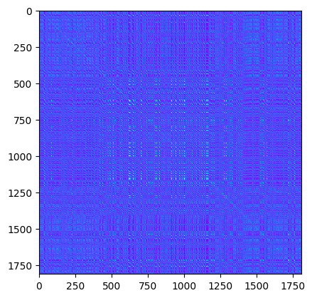
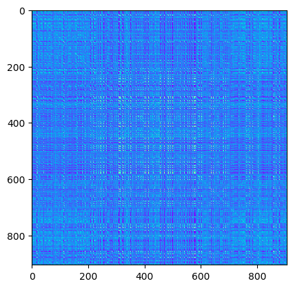
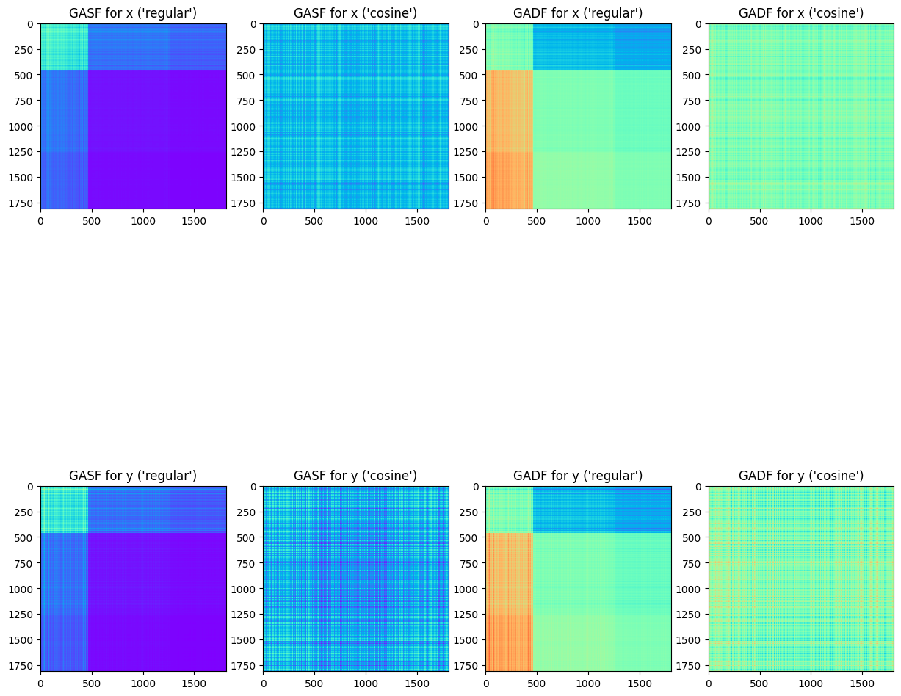

## EyeFeatures: fixations complex analysis

`complex` module of the library allows to get features which are represented as tensors (like vectors and matrices). Look at preprocessing and features tutorial to get grasp of simpler eyetracking attributes.


```python
import os
from tqdm import tqdm

import requests
import numpy as np
import pandas as pd
import matplotlib.pyplot as plt

import warnings
warnings.simplefilter("ignore")
```


```python
def get_paris_dataset():
    '''
    Download and load the Paris experiment dataset from Zenodo.
    The dataset contains scanpaths data from 15 participants reading approximately 180 texts.
    The dataset is normalized and split into X (fixations data), Y (target), and other features.
    Deatiled description of variables and task can be found at: https://zenodo.org/records/4655840
    '''
    if not os.path.exists("data/em-y35-fasttext.csv"):
        url = "https://zenodo.org/records/4655840/files/em-y35-fasttext.csv?download=1"
        response = requests.get(url, stream=True)

        os.makedirs("data", exist_ok=True)
        with open("data/em-y35-fasttext.csv", "wb") as handle:
            for data in tqdm(response.iter_content(chunk_size=1024)):
                handle.write(data)

    df = pd.read_csv("data/em-y35-fasttext.csv")
    df.X = df.X / df.X.max()
    df.Y = df.Y / df.Y.max()
    df = df.rename(columns={'FDUR': 'duration', 'X': 'norm_pos_x', 'Y': 'norm_pos_y'})
    df['timestamp'] = df.duration.cumsum()    # timestamps of fixations
    df['timestamp'] /= 1e3                    # milliseconds

    return df.drop(columns=['Unnamed: 0'])
```


```python
data = get_paris_dataset()
data = data[['SUBJ', 'norm_pos_x', 'norm_pos_y', 'timestamp', 'duration']]
data
```


<div>
<table border="1" class="dataframe">
  <thead>
    <tr style="text-align: right;">
      <th></th>
      <th>SUBJ</th>
      <th>norm_pos_x</th>
      <th>norm_pos_y</th>
      <th>timestamp</th>
      <th>duration</th>
    </tr>
  </thead>
  <tbody>
    <tr>
      <th>0</th>
      <td>1</td>
      <td>0.376268</td>
      <td>0.384969</td>
      <td>0.096</td>
      <td>96</td>
    </tr>
    <tr>
      <th>1</th>
      <td>1</td>
      <td>0.437754</td>
      <td>0.383532</td>
      <td>0.225</td>
      <td>129</td>
    </tr>
    <tr>
      <th>2</th>
      <td>1</td>
      <td>0.546146</td>
      <td>0.382957</td>
      <td>0.505</td>
      <td>280</td>
    </tr>
    <tr>
      <th>3</th>
      <td>1</td>
      <td>0.706643</td>
      <td>0.399626</td>
      <td>0.783</td>
      <td>278</td>
    </tr>
    <tr>
      <th>4</th>
      <td>1</td>
      <td>0.724645</td>
      <td>0.397615</td>
      <td>1.049</td>
      <td>266</td>
    </tr>
    <tr>
      <th>...</th>
      <td>...</td>
      <td>...</td>
      <td>...</td>
      <td>...</td>
      <td>...</td>
    </tr>
    <tr>
      <th>39559</th>
      <td>15</td>
      <td>0.420385</td>
      <td>0.796091</td>
      <td>7279.520</td>
      <td>142</td>
    </tr>
    <tr>
      <th>39560</th>
      <td>15</td>
      <td>0.536004</td>
      <td>0.806581</td>
      <td>7279.691</td>
      <td>171</td>
    </tr>
    <tr>
      <th>39561</th>
      <td>15</td>
      <td>0.526749</td>
      <td>0.882885</td>
      <td>7279.843</td>
      <td>152</td>
    </tr>
    <tr>
      <th>39562</th>
      <td>15</td>
      <td>0.757860</td>
      <td>0.875126</td>
      <td>7280.119</td>
      <td>276</td>
    </tr>
    <tr>
      <th>39563</th>
      <td>15</td>
      <td>0.701952</td>
      <td>0.888346</td>
      <td>7280.258</td>
      <td>139</td>
    </tr>
  </tbody>
</table>
<p>39564 rows × 5 columns</p>
</div>


```python
x = 'norm_pos_x'
y = 'norm_pos_y'
t = 'timestamp'
```

Let's pick subject #6:


```python
data1 = data[data['SUBJ'] == 6]
len(data1)
```


    1810


Alongside with algorithms described in previous tutorials, there is a toolkit for MFT, GADF/GASF and Hilbert Curve.


```python
import eyetracking.features.complex as eye_complex
```

### Hilbert Curve

Using a mapping from (x,y) point to the length on Hilbert Curve:


```python
p = 4
```


```python
hilbert_points = eye_complex.get_hilbert_curve(data1, x, y, scale=True, p=p)
hilbert_points
```


    array([  8.,  11., 229., ...,  25., 226.,  33.])


Get same values as encoded feature vector (boolean encoding), where each binary value represents presence of fixations in corresponding block:


```python
hilbert_points_enc = eye_complex.get_hilbert_curve_enc(data1, x, y, scale=True, p=p)
hilbert_points_enc.reshape((2 ** p, 2 ** p))
```


    array([[0., 1., 0., 1., 1., 1., 1., 1., 1., 1., 1., 1., 1., 1., 0., 0.],
           [1., 1., 1., 0., 0., 0., 1., 1., 1., 1., 1., 1., 1., 1., 1., 1.],
           [1., 1., 1., 1., 1., 1., 1., 1., 1., 1., 1., 1., 1., 1., 1., 1.],
           [1., 1., 1., 1., 1., 1., 1., 1., 1., 1., 0., 1., 0., 1., 1., 0.],
           [1., 0., 0., 1., 1., 1., 1., 1., 1., 1., 1., 1., 1., 1., 0., 0.],
           [0., 0., 0., 0., 0., 0., 0., 0., 0., 1., 0., 1., 1., 1., 1., 1.],
           [1., 1., 0., 1., 0., 0., 0., 1., 1., 0., 0., 0., 1., 0., 1., 1.],
           [1., 1., 1., 1., 1., 1., 1., 1., 1., 1., 1., 1., 1., 1., 1., 1.],
           [1., 1., 1., 1., 1., 1., 1., 1., 1., 1., 1., 1., 1., 1., 1., 0.],
           [1., 1., 1., 0., 0., 0., 0., 0., 0., 0., 0., 0., 0., 1., 1., 1.],
           [1., 1., 0., 1., 0., 0., 0., 1., 0., 0., 0., 0., 0., 0., 1., 0.],
           [0., 1., 1., 1., 0., 1., 1., 1., 1., 1., 1., 1., 1., 1., 1., 1.],
           [1., 1., 1., 1., 1., 1., 1., 1., 1., 1., 1., 1., 1., 1., 1., 1.],
           [1., 1., 1., 1., 1., 1., 1., 1., 1., 1., 1., 1., 1., 1., 1., 1.],
           [1., 1., 1., 1., 1., 1., 1., 1., 1., 0., 0., 0., 0., 1., 1., 0.],
           [0., 0., 1., 0., 1., 1., 1., 1., 1., 1., 1., 1., 0., 1., 0., 0.]])


### Markov Transition Field

Get MTF for y-coordinate of observed subject:


```python
mtf = eye_complex.get_mtf(data1, x, y, n_bins=20)
mtf.shape, len(data1)
```


    ((2, 1810, 1810), 1810)


```python
plt.imshow(mtf[1, :, :], cmap='rainbow');
```


    

    


Use max pooling to shrink images/complex_output:


```python
mtf_max = eye_complex.get_mtf(data1, x, y, n_bins=20, images/complex_output_size=0.5, shrink_strategy='max')
mtf_max.shape, len(data1) // 2
```


    ((2, 905, 905), 905)


```python
plt.imshow(mtf_max[1, :, :], cmap='rainbow');
```


    

    


### Gramian Angular Field

There are two methods to compute GAF: either using sine of difference or cosine of sum of angles in polar coordinates. Also, transformation from cartesian coordinates to polar ones could be done using two different methods: 'regular' (using arctan) and 'cosine' (taking cosine of amplitude of time-series).


```python
gasf_regular = eye_complex.get_gaf(data1, x, y, t='timestamp', field_type='sum', to_polar='regular')
gadf_regular = eye_complex.get_gaf(data1, x, y, t='timestamp', field_type='difference', to_polar='regular')
gasf_cosine = eye_complex.get_gaf(data1, x, y, t='timestamp', field_type='sum', to_polar='cosine')
gadf_cosine = eye_complex.get_gaf(data1, x, y, t='timestamp', field_type='difference', to_polar='cosine')
```


```python
fig, axes = plt.subplots(2, 4, figsize=(15, 15))
c_addon = ("for x", "for y")
t_addon = ("'regular'", "'cosine'")

for i in range(2):
    axes[i][0].imshow(gasf_regular[i], cmap='rainbow')
    axes[i][0].set(title=f"GASF {c_addon[i]} ({t_addon[0]})")
    axes[i][1].imshow(gasf_cosine[i], cmap='rainbow')
    axes[i][1].set(title=f"GASF {c_addon[i]} ({t_addon[1]})")
    axes[i][2].imshow(gadf_regular[i], cmap='rainbow')
    axes[i][2].set(title=f"GADF {c_addon[i]} ({t_addon[0]})")
    axes[i][3].imshow(gadf_cosine[i], cmap='rainbow')
    axes[i][3].set(title=f"GADF {c_addon[i]} ({t_addon[1]})")
```


    

    

